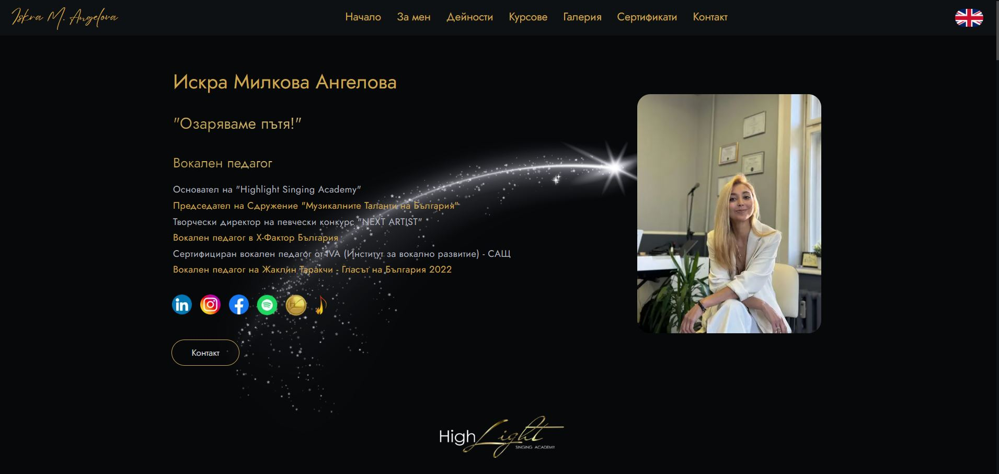
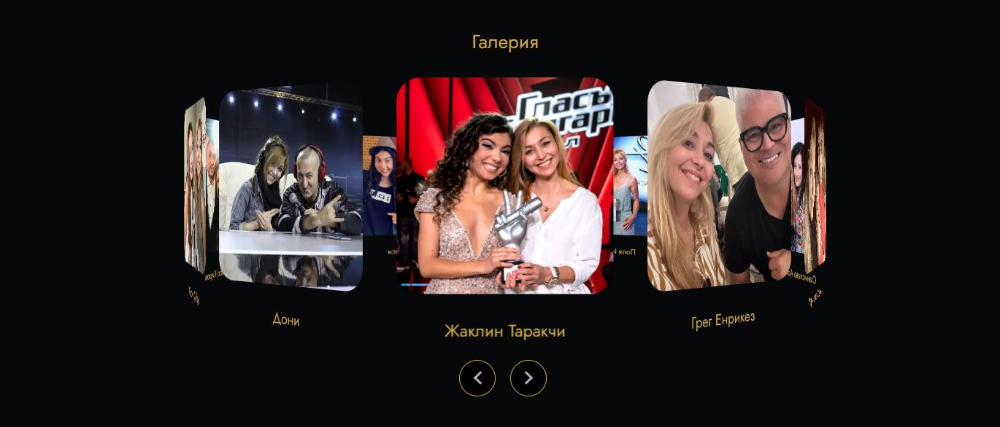
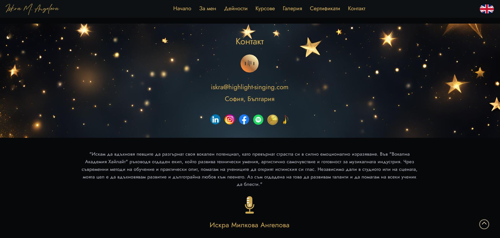
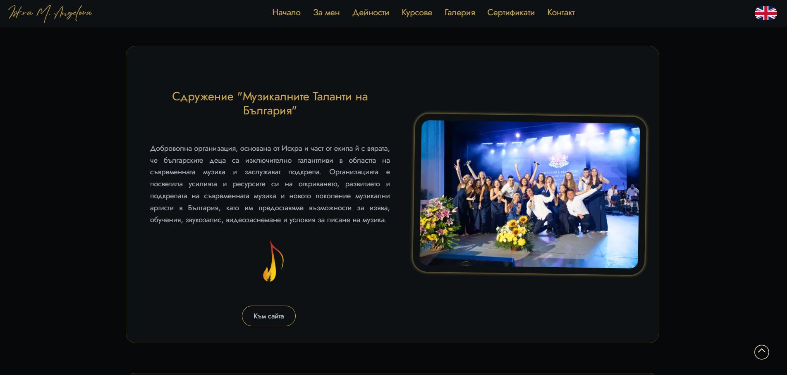
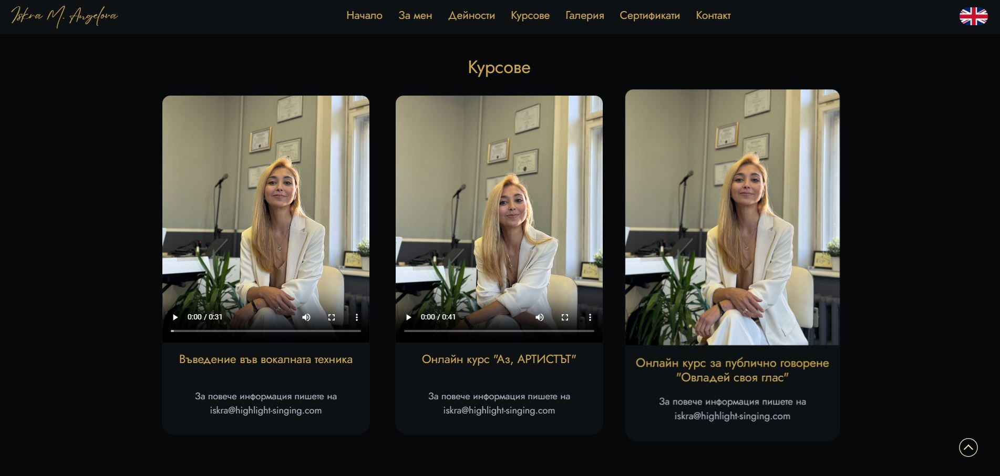
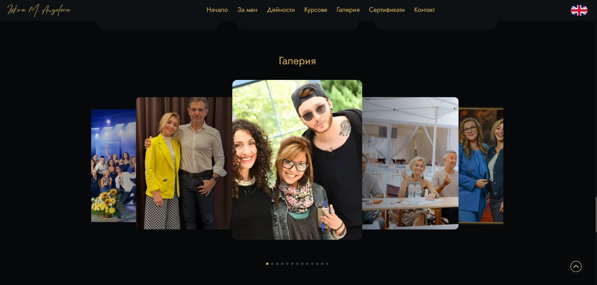
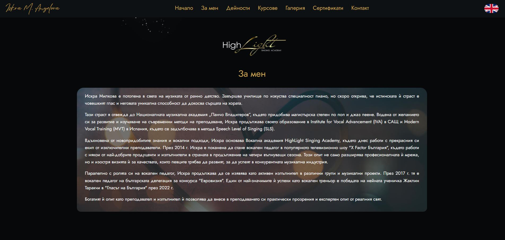

The portfolio was developed using Next.js 14 and TypeScript for a vocal and artist coach based in Sofia, Bulgaria. It integrates several external libraries and tools for enhanced functionality and interactivity, including GSAP for animations, Lottie-React for dynamic visual effects, and Swiper and Slick-Carousel for responsive carousels. Internationalization support is implemented using Next-Intl, allowing content to be tailored to multiple languages. Additionally, Bootstrap and React-Icons are used for styling and iconography, ensuring the site is fully responsive across all devices.

Open this link [https://www.iskra-vocal-coach.com](https://www.iskra-vocal-coach.com) to view it.

## Summary
0. Intro section
1. About me section + 3d rotating gallery
2. Activities section
3. Courses section
4. Gallery section
5. Certificates section
6. Contact section

## Portfolio images

## Available Scripts

### `npm install`
### `npm run dev`

Open this link [http://localhost:3000](http://localhost:3000) to view it in your browser.