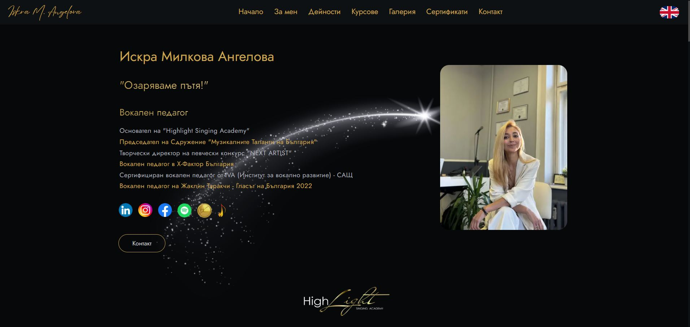
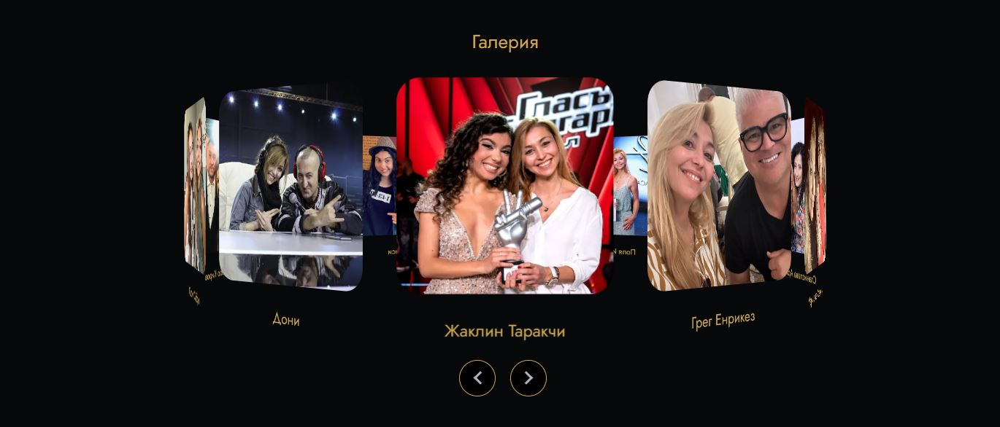
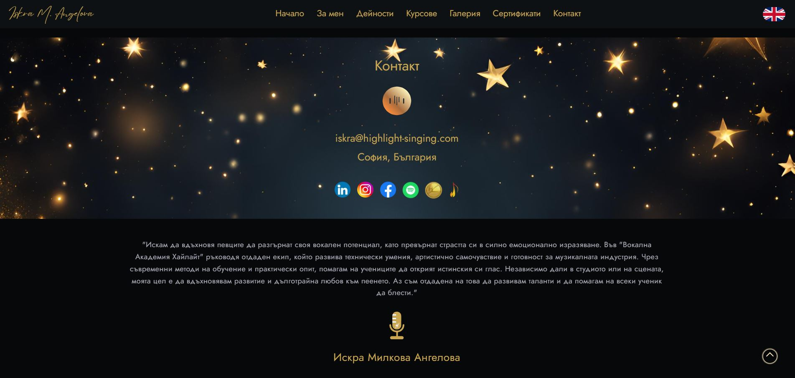
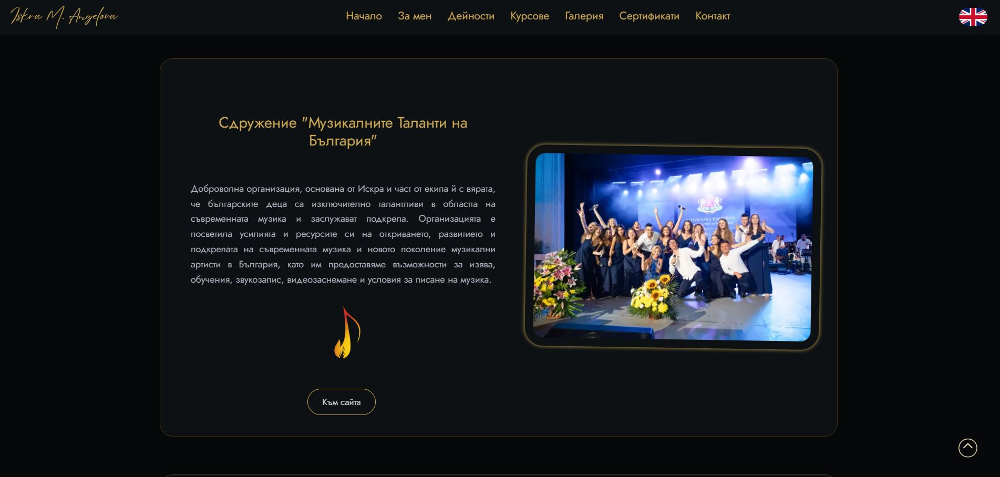
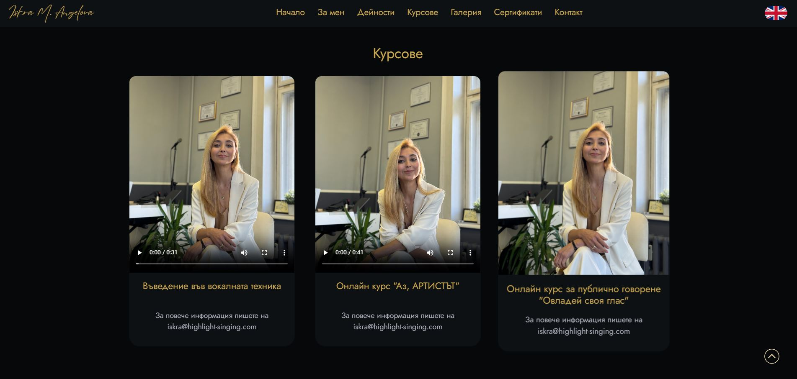
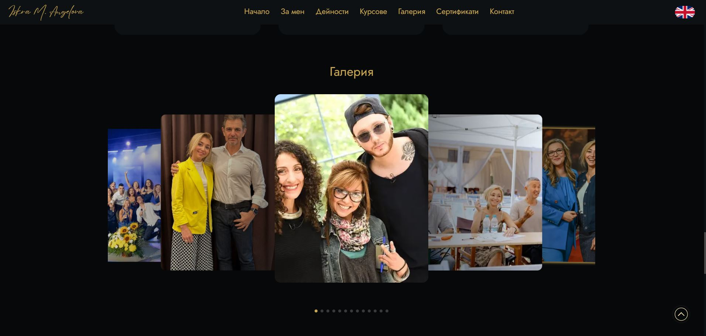
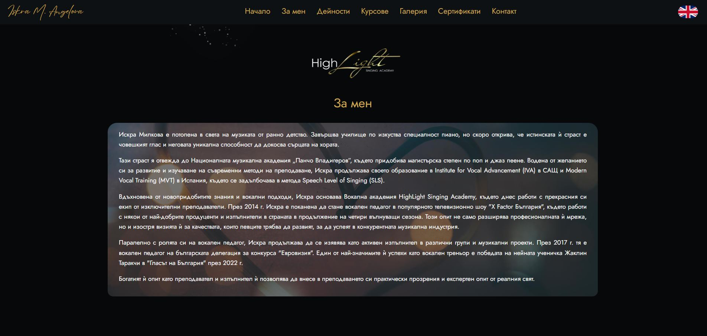

The portfolio was developed using Next.js 14 and TypeScript for a vocal and artist coach based in Sofia, Bulgaria. It integrates several external libraries and tools for enhanced functionality and interactivity, including GSAP for animations, Lottie-React for dynamic visual effects, and Swiper for the gallery carousel. Internationalization support is implemented using Next-Intl, allowing content to be tailored to multiple languages. React-Icons provides the iconography, and the site is fully responsive across all devices.

Open this link [https://iskravocal.com](https://iskravocal.com) to view it.

## Summary
0. Intro section
1. About me section + 3d rotating gallery
2. Activities section
3. Courses section
4. Gallery section
5. Certificates section
6. Contact section

## Portfolio images

